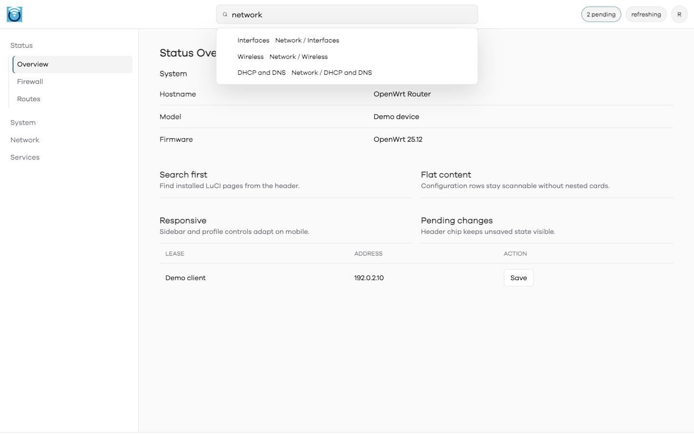

# I Love LuCI

I Love LuCI is a modern OpenWrt LuCI UI project. It contains:

- `luci-app-i-love-luci`: a React, Vite, Tailwind v4 application shell with shadcn-style local components, Sonner toasts, mobile-first navigation, search, profile menu, and a legacy LuCI iframe bridge.
- `luci-theme-i-love-luci`: the existing LuCI theme used for classic LuCI pages and as a compatibility fallback.

The app is the forward path. The theme remains useful for legacy LuCI routes while native React routes are rebuilt incrementally.

## Install Without Building

The intended user path is a package feed published from CI. Add the feed matching your OpenWrt release and target, then install with standard package tooling.

Public feed root:

<https://3aa49ec6bfc910647fa1c5a013e48eef.github.io/i-love-luci/>

OpenWrt 25.12/apk:

```sh
cat >/etc/apk/repositories.d/customfeeds.list <<'EOF'
https://3aa49ec6bfc910647fa1c5a013e48eef.github.io/i-love-luci/openwrt/25.12.4/rockchip-armv8
EOF

apk update
apk add luci-app-i-love-luci luci-theme-i-love-luci
```

OpenWrt 24.10/opkg:

```sh
cat >/etc/opkg/customfeeds.d/i-love-luci.conf <<'EOF'
src/gz i_love_luci https://3aa49ec6bfc910647fa1c5a013e48eef.github.io/i-love-luci/openwrt/24.10.7/rockchip-armv8
EOF

opkg update
opkg install luci-app-i-love-luci luci-theme-i-love-luci
```

After install, open:

```text
http://router-address/cgi-bin/luci/admin/i-love-luci
```

Feed signing is not configured yet. If your router enforces signed third-party feeds, download the matching GitHub Actions artifact or GitHub Release asset and install manually with `opkg install` for `.ipk` builds or `apk add --allow-untrusted --force-overwrite` for `.apk` builds.

## Screenshots

Screenshots are captured from a router running OpenWrt 25.12.4 with sanitized app data. They avoid real hostnames, addresses, MACs, leases, and configuration values.

| Desktop shell | Desktop search |
| --- | --- |
|  |  |

| Mobile shell | Mobile sidebar |
| --- | --- |
|  |  |

| Mobile search | Classic theme |
| --- | --- |
|  |  |

## Current Status

The modern app spike is installed and smoke-tested on a FriendlyElec NanoPi R6S running:

- OpenWrt `25.12.4`
- target `rockchip/armv8`
- package architecture `aarch64_generic`
- package manager `apk`

Verified on-router:

- `/cgi-bin/luci/admin/i-love-luci` returns a standalone app document after LuCI auth.
- App assets load from `/luci-static/i-love-luci-app/`.
- The root app viewport is configured with `initial-scale=1.0`, `maximum-scale=1.0`, and `user-scalable=no` to avoid mobile input zoom.
- `rpcd` bridge calls work through `/ubus/` with the LuCI session id.
- Desktop breakpoint shows sidebar and hides mobile menu button.
- Mobile breakpoint shows compact header, drawer sidebar, and search popover.
- Screenshots in `docs/assets/app-*.png` were captured from the live router.

## Product Direction

I Love LuCI should feel like a focused admin tool, not a marketing site. It should prioritize scanning, search, configuration confidence, mobile usability, and compatibility with existing LuCI packages.

The architecture is a hybrid shell:

- Native modern shell for high-value routes.
- `rpcd`/`ubus` bridge for router data and privileged actions.
- Legacy iframe bridge for LuCI pages not yet rebuilt.
- Existing `luci-theme-i-love-luci` for classic pages and fallback styling.

The implementation plan lives in [docs/UI_REFACTOR.md](docs/UI_REFACTOR.md).

## Modern App Stack

The app shell uses:

- React
- Vite
- TypeScript
- Tailwind CSS v4 through `@tailwindcss/vite`
- shadcn-style local components under `src/components/ui`
- Sonner toasts
- lucide-react icons
- CSSTools `@csstools/postcss-media-minmax` as a postbuild transform for Tailwind v4 media-query range output

The app owns its document, CSS, logo, and font assets. It does not embed inside the classic LuCI theme header, which avoids legacy CSS collisions in the core app.

Relevant references:

- Vite: <https://vite.dev/guide/>
- Tailwind CSS v4: <https://tailwindcss.com/docs/installation/using-vite>
- shadcn/ui Vite install: <https://ui.shadcn.com/docs/installation/vite>
- shadcn/ui Tailwind v4: <https://ui.shadcn.com/docs/tailwind-v4>
- shadcn/ui Sonner: <https://ui.shadcn.com/docs/components/sonner>
- Sonner: <https://github.com/emilkowalski/sonner>
- LuCI JS API: <https://openwrt.github.io/luci/jsapi/index.html>
- LuCI example app: <https://github.com/openwrt/luci/tree/master/applications/luci-app-example>

## Layout

```text
applications/luci-app-i-love-luci/
  Makefile
  htdocs/luci-static/i-love-luci-app/
  root/usr/share/luci/menu.d/luci-app-i-love-luci.json
  root/usr/share/rpcd/acl.d/luci-app-i-love-luci.json
  root/usr/share/rpcd/ucode/i-love-luci.uc
  src/shell/
  ucode/template/i-love-luci/app.ut

themes/luci-theme-i-love-luci/
  Makefile
  htdocs/luci-static/i-love-luci/
  htdocs/luci-static/resources/menu-i-love-luci.js
  root/etc/uci-defaults/30_luci-theme-i-love-luci
  ucode/template/themes/i-love-luci/
```

## Build Frontend

```sh
cd applications/luci-app-i-love-luci/src/shell
npm install
npm run lint
npm run typecheck
npm run test
npm run build
```

The production build writes static assets to:

```text
applications/luci-app-i-love-luci/htdocs/luci-static/i-love-luci-app/
```

Node.js is only used at build time. No Node.js runtime is required on the router.

## Build OpenWrt Packages

The CI build script uses official Linux x86_64 OpenWrt SDKs. Run it in GitHub Actions or an amd64 Linux environment.

Build both app and theme for OpenWrt 25.12:

```sh
PACKAGE_SPECS='luci-theme-i-love-luci:themes/luci-theme-i-love-luci luci-app-i-love-luci:applications/luci-app-i-love-luci' \
OPENWRT_VERSION=25.12.4 \
OPENWRT_TARGET=rockchip/armv8 \
PACKAGE_FORMAT=apk \
scripts/build-openwrt-package.sh
```

Build both app and theme for OpenWrt 24.10:

```sh
PACKAGE_SPECS='luci-theme-i-love-luci:themes/luci-theme-i-love-luci luci-app-i-love-luci:applications/luci-app-i-love-luci' \
OPENWRT_VERSION=24.10.7 \
OPENWRT_TARGET=rockchip/armv8 \
PACKAGE_FORMAT=ipk \
scripts/build-openwrt-package.sh
```

Output goes to:

```text
dist/openwrt/<version>/rockchip-armv8/
```

The generated feed contains both packages plus the matching `Packages.gz` or `packages.adb` index.

## CI Publishing

`.github/workflows/build.yml` builds package feeds for:

- OpenWrt `24.10.7` `rockchip/armv8` as opkg `.ipk`
- OpenWrt `25.12.4` `rockchip/armv8` as apk `.apk`

Rules:

- Pull requests build artifacts only.
- `dev` and `uat` build test artifacts only.
- `main` builds stable artifacts and publishes GitHub Pages feed directories.
- Pull requests into `main` must come from `dev` or `uat`.
- Node.js 24 is used for the app frontend build.

Stable package version is `1.0.0-1`. Test builds use `PKG_RELEASE=<GitHub run number>`, producing upgradeable test versions without changing the stable semver base.

## Router Test Deploy

Local router credentials are stored in `.env`, which is ignored by Git.

For 25.12/apk package artifacts:

```sh
scp -O dist/openwrt/25.12.4/rockchip-armv8/luci-*-i-love-luci-*.apk root@192.168.1.1:/tmp/
ssh root@192.168.1.1 'apk add --allow-untrusted --force-overwrite /tmp/luci-*-i-love-luci-*.apk && rm -rf /tmp/luci-indexcache /tmp/luci-modulecache && /etc/init.d/rpcd reload && /etc/init.d/uhttpd restart'
```

For 24.10/opkg package artifacts:

```sh
scp -O dist/openwrt/24.10.7/rockchip-armv8/luci-*-i-love-luci_*.ipk root@192.168.1.1:/tmp/
ssh root@192.168.1.1 'opkg install /tmp/luci-*-i-love-luci_*.ipk && rm -rf /tmp/luci-indexcache /tmp/luci-modulecache && /etc/init.d/rpcd reload && /etc/init.d/uhttpd restart'
```

Router smoke checks:

```sh
curl -I http://router-address/cgi-bin/luci/admin/i-love-luci
curl -I http://router-address/luci-static/i-love-luci-app/assets/app.js
```

Browser smoke checks:

- Desktop `1280 x 800`: sidebar visible, mobile menu hidden, search centered.
- Mobile `390 x 844`: mobile menu visible, sidebar opens/closes, search popover fits viewport.
- Search returns LuCI route results.
- Profile initials menu opens and includes logout.
- Legacy route bridge opens existing LuCI pages.

## Secondary uhttpd Testing

For safer router testing, run a secondary `uhttpd` instance on port `8081` so the main LuCI admin session remains available.

```sh
uci -q delete uhttpd.iloveluci_test
uci set uhttpd.iloveluci_test='uhttpd'
uci add_list uhttpd.iloveluci_test.listen_http='0.0.0.0:8081'
uci add_list uhttpd.iloveluci_test.listen_http='[::]:8081'
uci set uhttpd.iloveluci_test.home='/www'
uci set uhttpd.iloveluci_test.ucode_prefix='/cgi-bin/luci=/usr/share/ucode/luci/uhttpd.uc'
uci set uhttpd.iloveluci_test.rfc1918_filter='1'
uci commit uhttpd
/etc/init.d/uhttpd restart
```

Test URL:

```text
http://router-address:8081/cgi-bin/luci/admin/i-love-luci
```

Cleanup:

```sh
uci -q delete uhttpd.iloveluci_test
uci commit uhttpd
/etc/init.d/uhttpd restart
```

## Rollback

Keep classic LuCI reachable while testing. To remove the app and theme:

OpenWrt 25.12/apk:

```sh
apk del luci-app-i-love-luci luci-theme-i-love-luci
rm -rf /tmp/luci-indexcache /tmp/luci-modulecache
/etc/init.d/rpcd reload
/etc/init.d/uhttpd restart
```

OpenWrt 24.10/opkg:

```sh
opkg remove luci-app-i-love-luci luci-theme-i-love-luci
rm -rf /tmp/luci-indexcache /tmp/luci-modulecache
/etc/init.d/rpcd reload
/etc/init.d/uhttpd restart
```

## Security Notes

- MFA UI is a spike only. Real MFA must be server-side through `rpcd`/`ubus`, with TOTP secrets stored root-only and verified on the router.
- Passkey/WebAuthn support is possible later, but should be optional and requires HTTPS plus server-side challenge validation.
- The React app is never the source of security truth.
- Do not commit router credentials, package signing keys, or screenshots containing real hostnames, MACs, leases, addresses, or secrets.
