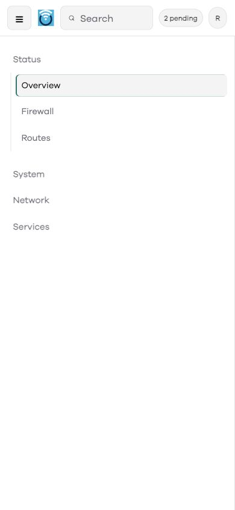

# I Love LuCI

I Love LuCI is a LuCI theme forked from `luci-theme-openwrt-2020`, based on upstream LuCI commit `c7b95dc`.

## Intent

This project exists to make OpenWrt LuCI feel current without losing what makes LuCI useful: fast pages, predictable navigation, low dependencies, and compatibility with existing OpenWrt packages.

The theme should be clean, minimal, and practical for daily router administration. It should improve discoverability for users who do not already know where every setting lives, while staying efficient for advanced users who move through LuCI quickly.

The long-term goal is a polished I Love LuCI theme that can be installed as a normal LuCI theme package, selected from LuCI's language/style settings, and safely tested on real routers without touching unrelated system configuration.

## Install Without Building

The intended user path is an installable package feed published from CI, not asking users to clone this repo or run the OpenWrt SDK. The public feed is published by GitHub Pages at:

- <https://3aa49ec6bfc910647fa1c5a013e48eef.github.io/i-love-luci/>

Users should add the feed that matches their OpenWrt release and target, update package metadata, then install the theme with standard tooling.

For OpenWrt 24.10/opkg:

```sh
cat >/etc/opkg/customfeeds.d/i-love-luci.conf <<'EOF'
src/gz i_love_luci https://3aa49ec6bfc910647fa1c5a013e48eef.github.io/i-love-luci/openwrt/24.10.7/rockchip-armv8
EOF

opkg update
opkg install luci-theme-i-love-luci
```

For OpenWrt 25.12/apk:

```sh
cat >/etc/apk/repositories.d/customfeeds.list <<'EOF'
https://3aa49ec6bfc910647fa1c5a013e48eef.github.io/i-love-luci/openwrt/25.12.4/rockchip-armv8
EOF

apk update
apk add luci-theme-i-love-luci
```

The feed publishing workflow is in place, but feed signing keys are not configured yet. If your router enforces signed third-party feeds, download the matching GitHub Actions artifact or GitHub Release asset and install the package manually. Use `opkg install` for 24.10 `.ipk` builds and `apk add --allow-untrusted --force-overwrite` for 25.12 `.apk` builds.

## Binary Publishing Plan

The CI/CD publishing model is:

- Pull requests: build both OpenWrt targets and upload short-lived GitHub Actions artifacts only.
- Pushes to `dev` or `uat`: build both targets as test artifacts only. These use `PKG_VERSION=1.0.0` and `PKG_RELEASE=<GitHub run number>`, producing package versions such as `1.0.0-123` for opkg and `1.0.0-r123` for apk. This makes test builds upgradeable without changing the public stable version.
- Pushes to `main`: build both targets as the stable public package with `PKG_VERSION=1.0.0` and `PKG_RELEASE=1`, then publish feed directories to GitHub Pages.
- GitHub Pages paths: `/openwrt/24.10.7/rockchip-armv8/` and `/openwrt/25.12.4/rockchip-armv8/`.
- Merging to `main`: must be done with a pull request. A required CI guard only allows `dev` or `uat` as the source branch for PRs targeting `main`.
- Version tags such as `v1.0.0`: should also attach immutable `.ipk`, `.apk`, feed index, checksum, and build metadata files to a GitHub Release. This release-asset step is not implemented yet.
- Prerelease tags such as `v1.1.0-rc.1`: should mark the GitHub Release as prerelease and publish to a separate prerelease feed path so stable users do not receive RC builds by accident. This prerelease path is not implemented yet.
- Signing: publish `Packages.sig` for 24.10/opkg using `usign`; publish the 25.12/apk feed with the SDK apk signing flow and document the public key installation path before asking users to trust the feed. Signing secrets are not configured yet.

This gives users two standard install paths: add a feed and install with package tooling, or download a release asset for one-off manual installation.

## Screenshots

These screenshots are generated from a sanitized demo page using the current theme CSS. They do not contain real router hostnames, addresses, leases, MACs, or configuration values.




## Design Goals

- Modern minimal shell with stronger spacing, contrast, focus states, responsive behavior, and a global loading overlay to avoid route-change flashes.
- Better sidebar with active route states, parent items that route to their first child, sticky navigation, mobile outside-click collapse, and compact mode.
- Header search from the LuCI menu tree, with recent pages and type-ahead results.
- Header profile menu with initials and logout action.
- Built-in local variants: Ocean, Forest, Ember, and Contrast.
- Router-persisted theme settings for color, density, desktop menu position, simplified save behavior, and font.
- Accessible defaults: readable contrast, visible keyboard focus, skip links, reduced-motion support, and responsive layouts.
- No heavy frontend framework. Keep theme assets small and compatible with LuCI's existing JS, ucode templates, and package flow.

## Product Direction

I Love LuCI should feel like a focused admin tool, not a marketing site. The interface should prioritize scanning, search, configuration confidence, and quick access to status pages. Visual style should be restrained: clear typography, quiet surfaces, strong active states, and enough contrast to work well on low-quality displays or remote sessions.

## Design System Direction

The theme borrows shadcn/ui patterns as a visual language rather than installing shadcn/ui components directly. LuCI themes are static CSS, ucode templates, and LuCI JavaScript; shadcn/ui is a Tailwind-styled React component workflow. For this package, map LuCI markup onto shadcn-style primitives with CSS:

- `#mainmenu` maps to a light `Sidebar` pattern with quiet item rows, muted labels, and clear active state.
- Header search, the search popover, and the fallback command dialog map to shadcn `Command`.
- Main LuCI content should stay flat by default. Avoid nested card shells around `.cbi-map`, `.cbi-section`, and individual values; reserve card-like surfaces for modals, login, popovers, and genuinely repeated framed content.
- Inputs, selects, dropdowns, buttons, tabs, tables, alerts, and page actions should follow shadcn sizing, border, radius, focus, and muted-text patterns.

Do not add Tailwind just to express these styles. Tailwind v4 is the current shadcn/ui documentation path, but it requires a frontend build step and targets modern browsers. I Love LuCI currently keeps a no-build CSS path so packages stay simple and router-friendly. Revisit Tailwind only if the theme grows enough repeated component CSS to justify a generated stylesheet.

Relevant design references:

- shadcn/ui docs: <https://ui.shadcn.com/docs>
- shadcn/ui manual installation: <https://ui.shadcn.com/docs/installation/manual>
- shadcn/ui Tailwind v4 guide: <https://ui.shadcn.com/docs/tailwind-v4>
- Tailwind CSS v4 upgrade guide: <https://tailwindcss.com/docs/upgrade-guide>

Planned areas:

- Search that starts with installed LuCI pages and later expands toward config/schema discovery.
- Further reduction of legacy LuCI table/card artifacts in deep package views.
- Mobile behavior that makes router administration possible from a phone without awkward horizontal scrolling.
- Packaging and deploy helpers for quick install, rollback, and router testing.

Theme settings are stored in UCI under `luci.iloveluci`, so style, density, menu bar, simplified save, and font choices follow the router configuration instead of a single browser. Browser `localStorage` is only retained as a migration fallback and for per-browser recent-search history.

## Current UX

- Header: OpenWrt icon on the left, centered search on desktop, pending-change chip near status indicators, profile initials menu on the far right.
- Search: focus the header search or press `Cmd+K` / `Ctrl+K` / `/`; recent pages show before typing, results replace recent pages while typing.
- Sidebar: parent entries route to their first child, active leaf routes are highlighted, logout lives in the profile menu instead of the sidebar.
- Desktop menu position: side menu by default, optional top menu from theme settings. Top menu applies to desktop only.
- Mobile: header keeps menu, search, pending/profile controls compact; sidebar collapses when tapping outside it.
- Theme settings: `System > System > I Love LuCI Theme`.
- Simplified save: enabled by default. Page action rows collapse to Save/Cancel, pending changes appear as a header chip, and saved-but-not-applied changes trigger a top-center toast.
- Loading: internal route changes and form submits show a global loading overlay while LuCI swaps content.

## Layout

```text
themes/luci-theme-i-love-luci/
  Makefile
  htdocs/luci-static/i-love-luci/
  htdocs/luci-static/resources/menu-i-love-luci.js
  root/etc/uci-defaults/30_luci-theme-i-love-luci
  ucode/template/themes/i-love-luci/
```

## LuCI Theme Standards

This package follows the same package shape as the official LuCI themes in the OpenWrt LuCI feed:

- `Makefile` includes `$(TOPDIR)/rules.mk`, sets `LUCI_TITLE`, `LUCI_DEPENDS:=+luci-base`, `PKG_LICENSE`, and includes `../../luci.mk`.
- Static assets are installed from `htdocs/` into `/www/`, for example `/www/luci-static/i-love-luci/cascade.css`.
- ucode templates are installed from `ucode/template/themes/i-love-luci/` into LuCI's template path.
- `root/etc/uci-defaults/30_luci-theme-i-love-luci` registers `luci.themes.ILoveLuCI` and selects the theme on first install, matching the official OpenWrt theme behavior.
- The package removes its LuCI theme registration in `postrm`, matching the official theme packages.

Relevant upstream references:

- OpenWrt LuCI feed: <https://github.com/openwrt/luci>
- Official LuCI feed usage: <https://github.com/openwrt/luci#usage>
- Official `luci-theme-openwrt` package: <https://github.com/openwrt/luci/tree/openwrt-24.10/themes/luci-theme-openwrt>
- Official `luci-theme-openwrt-2020` package: <https://github.com/openwrt/luci/tree/openwrt-24.10/themes/luci-theme-openwrt-2020>
- Official `luci-theme-openwrt-2020` Makefile pattern: <https://raw.githubusercontent.com/openwrt/luci/openwrt-24.10/themes/luci-theme-openwrt-2020/Makefile>
- Official `luci-theme-openwrt-2020` uci-defaults pattern: <https://raw.githubusercontent.com/openwrt/luci/openwrt-24.10/themes/luci-theme-openwrt-2020/root/etc/uci-defaults/30_luci-theme-openwrt-2020>
- Official ucode theme template example: <https://raw.githubusercontent.com/openwrt/luci/openwrt-24.10/themes/luci-theme-openwrt/ucode/template/themes/openwrt.org/header.ut>
- OpenWrt LuCI theme user docs: <https://openwrt.org/docs/guide-user/luci/luci.themes>

## Build In OpenWrt

Use a full OpenWrt buildroot when producing a normal package. The package should live under the LuCI feed's `themes/` directory so `include ../../luci.mk` resolves the same way it does for upstream themes.

```sh
cd /path/to/openwrt
./scripts/feeds update packages luci
mkdir -p feeds/luci/themes
cp -R /path/to/i-love-luci/themes/luci-theme-i-love-luci feeds/luci/themes/
./scripts/feeds update -i luci
./scripts/feeds install luci-theme-i-love-luci
make package/feeds/luci/luci-theme-i-love-luci/compile V=s
```

The package will be emitted under `bin/packages/*/luci/`.

## Build With The OpenWrt SDK

The router this project is currently tested against is a FriendlyElec NanoPi R6S. Official OpenWrt images exist for the device on both supported release lines:

- target `rockchip/armv8`
- package architecture `aarch64_generic`

The CI build matrix currently targets:

| OpenWrt series | Current target version | Package format | Feed index |
| --- | --- | --- | --- |
| 24.10 old stable | `24.10.7` | `.ipk` | `Packages` / `Packages.gz` |
| 25.12 stable | `25.12.4` | `.apk` | `packages.adb` |

Build both supported targets with:

```sh
OPENWRT_VERSION=24.10.7 OPENWRT_TARGET=rockchip/armv8 PACKAGE_FORMAT=ipk scripts/build-openwrt-package.sh
OPENWRT_VERSION=25.12.4 OPENWRT_TARGET=rockchip/armv8 PACKAGE_FORMAT=apk scripts/build-openwrt-package.sh
```

The script downloads the matching OpenWrt release SDK, fetches the pinned base, package, and LuCI feeds from `feeds.conf.default`, copies this package into the SDK's LuCI feed, runs the SDK build, and writes a minimal package feed containing this theme plus its feed index to `dist/openwrt/<version>/rockchip-armv8/`.

The build script uses the official Linux x86_64 OpenWrt SDK and is intended to run in GitHub Actions or another Linux x86_64 environment. On macOS, use the GitHub Actions workflow or an amd64 Linux container instead of running the SDK directly. Required Ubuntu build dependencies include `python3-distutils`. Builds default to `JOBS=1` to avoid nested GNU make jobserver failures in LuCI dependencies; set `JOBS=<n>` only after confirming the SDK target is stable with parallel builds.

For manual SDK work, the matching SDKs are:

```sh
mkdir -p build/sdk
curl -L \
  -o build/openwrt-sdk-24.10.7-rockchip-armv8.tar.zst \
  https://downloads.openwrt.org/releases/24.10.7/targets/rockchip/armv8/openwrt-sdk-24.10.7-rockchip-armv8_gcc-13.3.0_musl.Linux-x86_64.tar.zst

curl -L \
  -o build/openwrt-sdk-25.12.4-rockchip-armv8.tar.zst \
  https://downloads.openwrt.org/releases/25.12.4/targets/rockchip/armv8/openwrt-sdk-25.12.4-rockchip-armv8_gcc-14.3.0_musl.Linux-x86_64.tar.zst
```

SDK builds should use the same feed layout as the full buildroot flow above. If the SDK tries to rebuild LuCI runtime dependencies and fails on missing core headers or packages, use a full OpenWrt buildroot for the release package. That keeps this theme aligned with the upstream LuCI theme packaging path instead of adding local package hacks.

## GitHub Actions Build Pipeline

`.github/workflows/build.yml` builds the package for:

- OpenWrt `24.10.7` `rockchip/armv8` as an opkg `.ipk` feed artifact.
- OpenWrt `25.12.4` `rockchip/armv8` as an apk `.apk` feed artifact.

The workflow runs on pushes to `dev` and `main`, pull requests, and manual dispatch. It uploads each generated feed directory as a GitHub Actions artifact. For non-PR runs, it also publishes the feed directories to GitHub Pages.

Stable `main` artifacts are named:

- `i-love-luci-stable-24.10.7-ipk`
- `i-love-luci-stable-25.12.4-apk`

Test artifacts from `dev`, `uat`, and pull requests are named:

- `i-love-luci-test-24.10.7-ipk`
- `i-love-luci-test-25.12.4-apk`

Download the latest 25.12.4 test artifact with:

```sh
gh run list --branch dev --limit 5
gh run download <run-id> --pattern 'i-love-luci-test-25.12.4-apk' --dir /tmp/i-love-luci
```

See [Binary Publishing Plan](#binary-publishing-plan) for the release/feed publishing strategy.

## Upload To Router

Local router credentials are stored in `.env`, which is ignored by Git and excluded from bundles. Do not commit router passwords or generated package artifacts.

For OpenWrt 24.10/opkg:

```sh
scp bin/packages/*/luci/luci-theme-i-love-luci_*.ipk root@192.168.1.1:/tmp/
ssh root@192.168.1.1 'opkg install /tmp/luci-theme-i-love-luci_*.ipk && /etc/init.d/uhttpd restart'
```

For OpenWrt 25.12/apk:

```sh
scp dist/openwrt/25.12.4/rockchip-armv8/luci-theme-i-love-luci-*.apk root@192.168.1.1:/tmp/
ssh root@192.168.1.1 'apk add --allow-untrusted --force-overwrite /tmp/luci-theme-i-love-luci-*.apk && rm -rf /tmp/luci-indexcache /tmp/luci-modulecache && /etc/init.d/uhttpd restart'
```

Then select **ILoveLuCI** in LuCI under `System > System > Language and Style`. LuCI theme keys cannot contain spaces, so the package registers the selectable theme key as `ILoveLuCI` while the project and package display name remains I Love LuCI.

## Current Search Scope

Search indexes the full LuCI menu tree client-side, so it finds installed pages/features. It intentionally excludes the theme settings page from search results. Deep UCI option search needs a backend index endpoint later, because themes do not automatically receive every config schema/value.

Recent pages are stored per browser in `localStorage`; theme options are stored in router UCI config.

## Non-Goals

- Replacing LuCI's core application framework.
- Changing router configuration defaults.
- Adding dependencies that make the theme fragile on small OpenWrt devices.
- Storing deploy credentials in Git history or release bundles.
