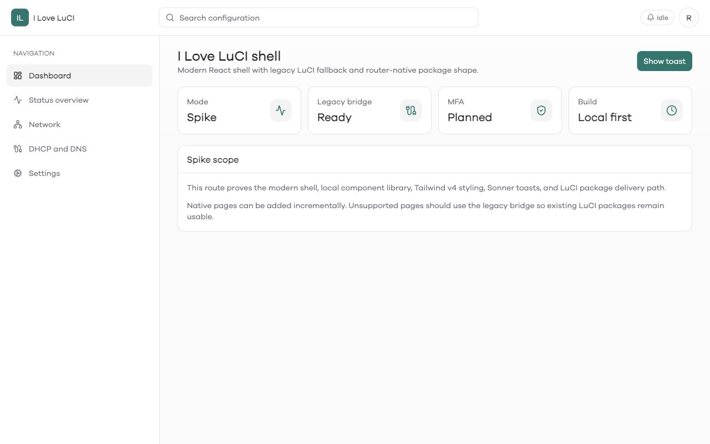
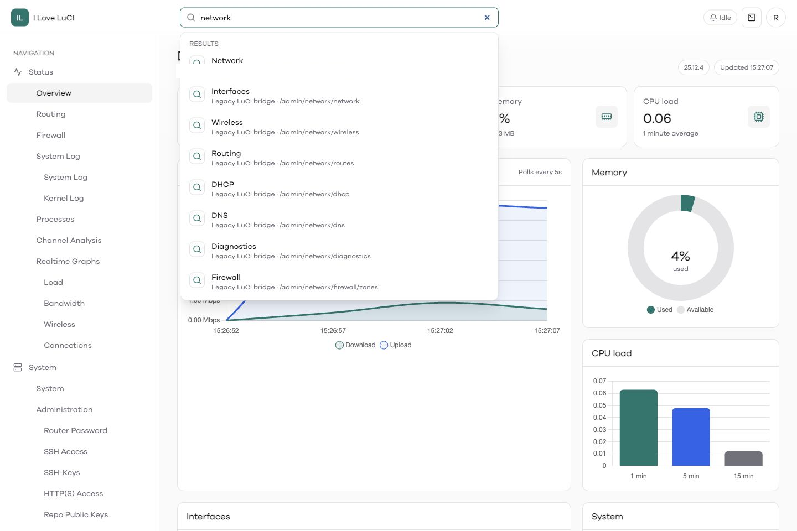
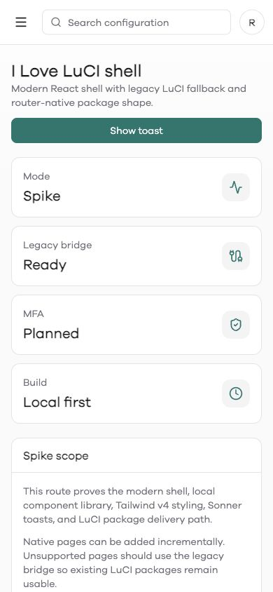
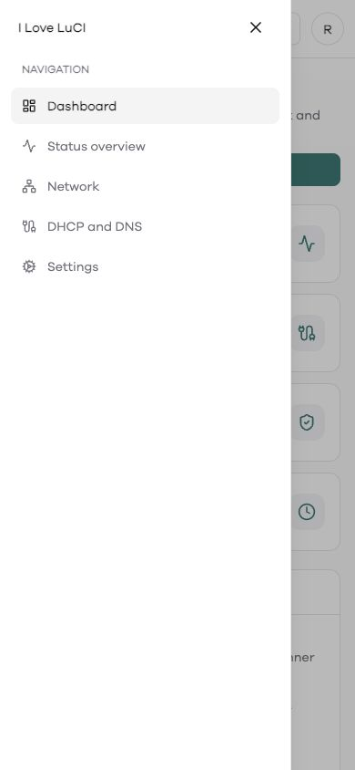
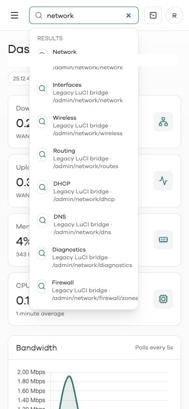
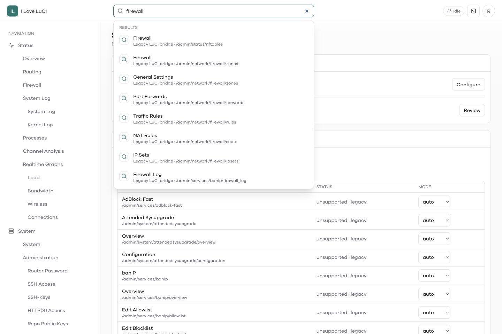
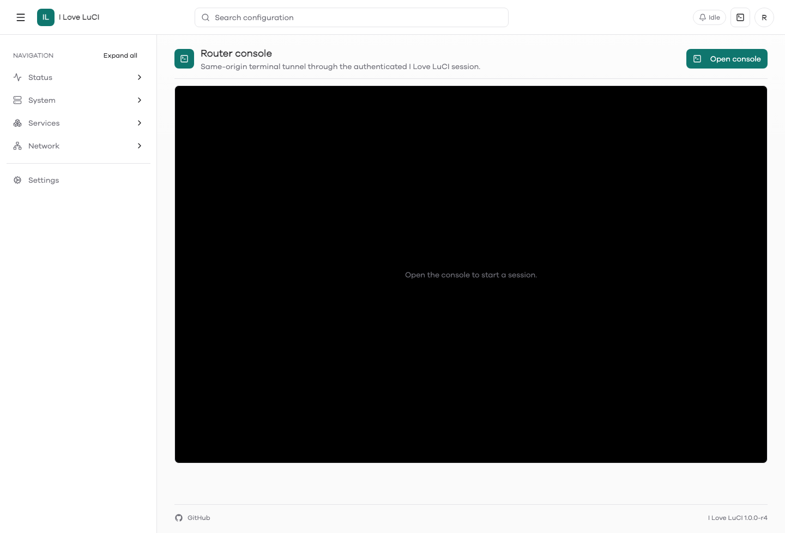

# I Love LuCI

I Love LuCI is a modern OpenWrt administration app for LuCI. It replaces the old theme-first approach with a standalone React shell, native dashboard, responsive navigation, route search, profile menu, web console bridge, and a compatibility bridge for existing LuCI pages.

## Sysupgrade Compatibility

`sysupgrade` does not guarantee that manually installed package files survive an OpenWrt release upgrade. Configuration can be preserved when users keep settings, but static package files under `/www`, LuCI templates, menu files, and `rpcd` scripts must be present in the upgraded firmware image or reinstalled from the package feed after the upgrade.

The package installs `/lib/upgrade/keep.d/luci-app-i-love-luci` so `/etc/config/i-love-luci` and the generated `ttyd` helper config are included in OpenWrt configuration backups. This protects settings, not the package binaries.

Recommended upgrade paths:

- Build `luci-app-i-love-luci` into the firmware image.
- Use Attended Sysupgrade or `owut` so installed packages are carried into the generated image where supported.
- Keep the I Love LuCI package feed configured, then reinstall `luci-app-i-love-luci` after a manual `sysupgrade`.

Current package shape:

- The package is still a LuCI application: it uses `luci.mk`, depends on `luci-base`, installs LuCI menu/template files, and uses LuCI session/auth paths.
- The React shell wraps and progressively replaces LuCI screens, but LuCI remains an upstream runtime dependency today.
- The legacy bridge only works when LuCI is installed.

Future-proof target:

- Split a standalone `i-love-luci` package from the LuCI-specific compatibility layer.
- Serve the React app directly through `uhttpd` instead of LuCI dispatcher/templates.
- Keep `rpcd`/`ubus` as the backend bridge, with first-party auth/session handling.
- Make LuCI optional: if installed, expose legacy routes through a compatibility adapter; if not installed, keep native I Love LuCI screens working.
- Keep release-specific feeds for 24.10/opkg and 25.12+/apk until the package manager transition has settled.

Relevant OpenWrt docs:

- [Sysupgrade using LuCI and CLI](https://openwrt.org/docs/guide-user/installation/generic.sysupgrade)
- [OpenWrt Upgrade Tool (`owut`)](https://openwrt.org/docs/guide-user/installation/sysupgrade.owut)
- [Attended Sysupgrade](https://openwrt.org/docs/guide-user/installation/attended.sysupgrade)
- [Creating OpenWrt packages](https://openwrt.org/docs/guide-developer/packages)
- [Using the OpenWrt SDK](https://openwrt.org/docs/guide-developer/toolchain/using_the_sdk)

## Install Without Building

Use the published package feed that matches your OpenWrt release and target.

Public feed root:

<https://3aa49ec6bfc910647fa1c5a013e48eef.github.io/i-love-luci/>

OpenWrt 25.12/apk:

```sh
cat >/etc/apk/repositories.d/i-love-luci.list <<'EOF'
https://3aa49ec6bfc910647fa1c5a013e48eef.github.io/i-love-luci/openwrt/25.12.4/rockchip-armv8/packages.adb
EOF

apk update --allow-untrusted
apk add --allow-untrusted luci-app-i-love-luci
```

OpenWrt 24.10/opkg:

```sh
cat >/etc/opkg/customfeeds.d/i-love-luci.conf <<'EOF'
src/gz i_love_luci https://3aa49ec6bfc910647fa1c5a013e48eef.github.io/i-love-luci/openwrt/24.10.7/rockchip-armv8
EOF

opkg update
opkg install luci-app-i-love-luci
```

Then open:

```text
http://router-address/cgi-bin/luci/admin/i-love-luci
```

Feed signing is not configured yet. OpenWrt 25.12/apk therefore requires `--allow-untrusted` for this feed. If you do not want to add the feed, install the matching GitHub Release asset manually with `opkg install` for `.ipk` builds or `apk add --allow-untrusted --force-overwrite` for `.apk` builds.

## Screenshots

Screenshots are captured from a router running OpenWrt with sanitized app data. They avoid real hostnames, addresses, MACs, leases, and configuration values.

| Dashboard | Search |
| --- | --- |
|  |  |

| Mobile | Mobile menu |
| --- | --- |
|  |  |

| Mobile search |
| --- |
|  |

| Route settings | Console bridge |
| --- | --- |
|  |  |

## Features

- Native React dashboard for bandwidth, CPU, and memory telemetry.
- Dynamic LuCI route discovery from installed menu definitions.
- Legacy bridge for LuCI apps that have not yet been rebuilt as native screens.
- Header search with recent routes and live results.
- Responsive sidebar and mobile-first layout.
- Profile menu with logout.
- Web console bridge backed by `ttyd`.
- Route compatibility settings so individual LuCI paths can use native, legacy, hidden, or automatic rendering.
- Local shadcn-style component library and Sonner toasts.

## Project Layout

```text
applications/luci-app-i-love-luci/
  Makefile
  htdocs/luci-static/i-love-luci-app/
  root/etc/config/i-love-luci
  root/etc/uci-defaults/90_luci-app-i-love-luci
  root/usr/share/luci/menu.d/luci-app-i-love-luci.json
  root/usr/share/rpcd/acl.d/luci-app-i-love-luci.json
  root/usr/share/rpcd/ucode/i-love-luci.uc
  frontend/shell/
  ucode/template/i-love-luci/app.ut
```

## Build Frontend

Check the local development toolchain before building or deploying:

```sh
scripts/check-dev-tools.sh
```

Required local tools are Node.js, npm, `python3`, `expect`, `jq`, `make`, `curl`, and `gh`.
Optional tools improve the loop: `ucode` for local bridge syntax checks, `usign` for local feed signing checks, `shellcheck` for script linting, and `jsonfilter` for matching OpenWrt JSON command behavior. The OpenWrt SDKs are Linux x86_64, so full package builds should run in GitHub Actions or an amd64 Linux/Docker environment when working from macOS.

```sh
cd applications/luci-app-i-love-luci/frontend/shell
npm ci
npm run lint
npm run typecheck
npm run test
npm run build
```

The production build writes static assets to:

```text
applications/luci-app-i-love-luci/htdocs/luci-static/i-love-luci-app/
```

Node.js is only used at build time. No Node.js runtime is required on the router.

## Build OpenWrt Package

The package build script uses official Linux x86_64 OpenWrt SDKs. Run it in GitHub Actions or an amd64 Linux environment.

OpenWrt 25.12/apk:

```sh
OPENWRT_VERSION=25.12.4 \
OPENWRT_TARGET=rockchip/armv8 \
PACKAGE_FORMAT=apk \
scripts/build-openwrt-package.sh
```

OpenWrt 24.10/opkg:

```sh
OPENWRT_VERSION=24.10.7 \
OPENWRT_TARGET=rockchip/armv8 \
PACKAGE_FORMAT=ipk \
scripts/build-openwrt-package.sh
```

Output goes to:

```text
dist/openwrt/<version>/rockchip-armv8/
```

## CI Publishing

`.github/workflows/build.yml` builds package feeds for:

- OpenWrt `24.10.7` `rockchip/armv8` as opkg `.ipk`
- OpenWrt `25.12.4` `rockchip/armv8` as apk `.apk`

Rules:

- Pull requests build artifacts only.
- `main` builds stable artifacts and publishes the GitHub Pages package feed.
- Pull requests into `main` must come from `dev` or `uat`.
- Node.js 22 LTS is used for the frontend build.

Stable package version is `1.0.0-r4`. Development and UAT work is validated through pull request builds; only `main` publishes package feed updates.

## OpenWrt Source Integration

To build inside an OpenWrt source tree, copy or overlay `applications/luci-app-i-love-luci` into the LuCI feed:

```sh
mkdir -p feeds/luci/applications/luci-app-i-love-luci
rsync -a applications/luci-app-i-love-luci/ feeds/luci/applications/luci-app-i-love-luci/
./scripts/feeds update luci
./scripts/feeds install luci-app-i-love-luci
make menuconfig
make package/feeds/luci/luci-app-i-love-luci/compile V=s
```

Enable `LuCI -> Applications -> luci-app-i-love-luci` in `menuconfig` if building firmware images.

## Router Test Deploy

Local router credentials belong in `.env`, which is ignored by Git.

For day-to-day development, use the reusable router scripts instead of hand-written SSH/SCP commands. The scripts read:

- `OPENWRT_HOST`
- `OPENWRT_USER` defaults to `root`
- `OPENWRT_PASSWORD`

Live asset deploy, useful while iterating on the frontend or rpcd bridge:

```sh
scripts/deploy-router-assets.sh
scripts/router-run.sh - <<'EOF'
ubus call luci.iloveluci session_info
uci changes
EOF
```

`scripts/deploy-router-assets.sh --no-build` redeploys the current generated assets, rpcd bridge, and login templates without rebuilding.

Full package install, useful when validating release artifacts:

```sh
scripts/router-install-package.sh dist/openwrt/25.12.4/rockchip-armv8/luci-app-i-love-luci-*.apk
```

Targeted command and file copy helpers:

```sh
scripts/router-run.sh ./local-router-check.sh
scripts/router-copy.sh ./local-file /tmp/local-file
```

After install, run the route compatibility audit:

```sh
scripts/audit-router-routes.sh
scripts/audit-router-route-mode-guards.sh
scripts/audit-router-future-luci-app.sh
scripts/audit-router-native-pages.sh
scripts/smoke-router-http-routes.sh
```

The audit verifies that visible LuCI routes resolve to either native I Love LuCI screens or the LuCI compatibility bridge, compat routes reject native-mode overrides, iframe source URLs load with `iloveluci_frame=1`, incomplete LuCI app routes default to compat mode, and installed `luci-app-*` routes remain discoverable for current and future app installs. The future-app audit temporarily installs and removes `luci-app-example`, then checks that new routes appear through compat and cleanup restores package state.

## Secondary uhttpd Testing

For safer router testing, run a secondary `uhttpd` instance on port `8081` so the main LuCI admin session remains available.

```sh
uci -q delete uhttpd.iloveluci_test
uci set uhttpd.iloveluci_test='uhttpd'
uci add_list uhttpd.iloveluci_test.listen_http='0.0.0.0:8081'
uci add_list uhttpd.iloveluci_test.listen_http='[::]:8081'
uci set uhttpd.iloveluci_test.home='/www'
uci set uhttpd.iloveluci_test.ucode_prefix='/cgi-bin/luci=/usr/share/ucode/luci/uhttpd.uc'
uci set uhttpd.iloveluci_test.rfc1918_filter='1'
uci commit uhttpd
/etc/init.d/uhttpd restart
```

Test URL:

```text
http://router-address:8081/cgi-bin/luci/admin/i-love-luci
```

Cleanup:

```sh
uci -q delete uhttpd.iloveluci_test
uci commit uhttpd
/etc/init.d/uhttpd restart
```

## Rollback

OpenWrt 25.12/apk:

```sh
apk del luci-app-i-love-luci
rm -rf /tmp/luci-indexcache /tmp/luci-modulecache
/etc/init.d/rpcd reload
/etc/init.d/uhttpd restart
```

OpenWrt 24.10/opkg:

```sh
opkg remove luci-app-i-love-luci
rm -rf /tmp/luci-indexcache /tmp/luci-modulecache
/etc/init.d/rpcd reload
/etc/init.d/uhttpd restart
```

## References

- LuCI JavaScript API: <https://openwrt.github.io/luci/jsapi/index.html>
- LuCI example app: <https://github.com/openwrt/luci/tree/master/applications/luci-app-example>
- OpenWrt SDK guide: <https://openwrt.org/docs/guide-developer/toolchain/using_the_sdk>
- Vite: <https://vite.dev/guide/>
- React Router: <https://reactrouter.com/>
- Tailwind CSS v4 with Vite: <https://tailwindcss.com/docs/installation/using-vite>
- shadcn/ui Vite install: <https://ui.shadcn.com/docs/installation/vite>
- shadcn/ui Tailwind v4: <https://ui.shadcn.com/docs/tailwind-v4>
- Sonner: <https://sonner.emilkowal.ski/>
- ttyd: <https://github.com/tsl0922/ttyd>

## Security Notes

- The React app is never the source of security truth. Privileged work must go through LuCI, `rpcd`, `ubus`, or OpenWrt services.
- The web console bridge depends on `ttyd`. Treat the generated console credential as sensitive router configuration.
- Passkey and MFA support require server-side challenge and secret handling before they are production-ready.
- Do not commit router credentials, package signing keys, or screenshots containing real hostnames, MACs, leases, addresses, or secrets.
